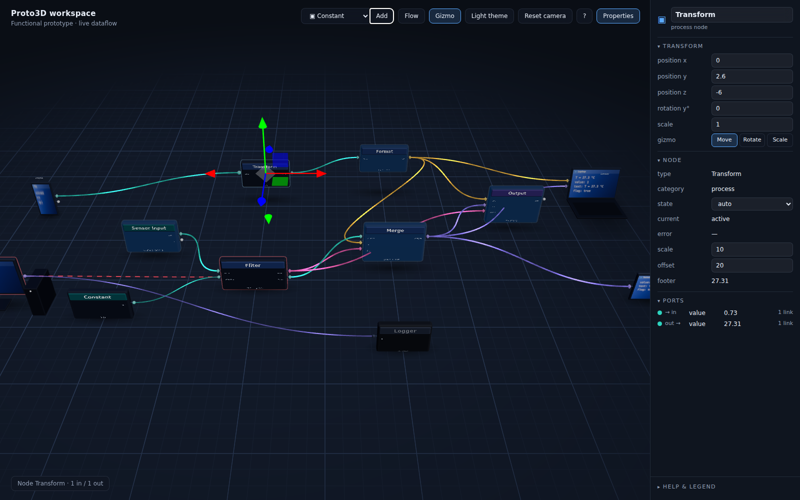
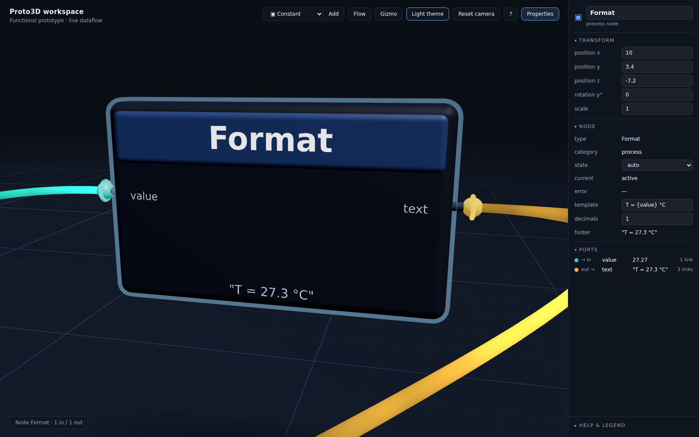

# Proto3D — a 3D visual-programming workspace (functional prototype)

Proto3D is a browser-based prototype for a fully 3D node-graph workspace: the usability of
Blueprint / Blender-style node editing, placed in a calm, premium 3D room. The first round
established the **visual language**; this round makes it **work**: nodes evaluate a live
dataflow graph, connections carry real values, devices emit and display data, a Blender/Unreal
style **properties panel** on the right edits everything, a **transform gizmo** moves, rotates
and scales blocks, and the whole room switches between a **dark and a light theme**.





More: [`docs/shots/light-overview.png`](docs/shots/light-overview.png) is the same scene in the light theme.

## Run

Static files, no build step.

- **Any static server**: `python3 -m http.server` in this folder, then open `http://localhost:8000/`.
- **GitHub Pages**: publish the folder as-is (all paths are relative).
- **file://**: double-click `index.html` in a browser that allows module scripts from disk (Chrome does; Three.js is loaded from unpkg via an import map, so an internet connection is required).

Three.js r160 is pulled from `https://unpkg.com/three@0.160.0/` through the import map in
`index.html`. To run offline, copy `node_modules/three` next to the page and point the two
import-map entries at it.

## Module map

| File | Owns |
| --- | --- |
| `index.html` | Import map, viewport, toolbar, the properties panel shell (with the collapsible help/legend at its bottom), selection readout. Applies the persisted theme before first paint. |
| `styles.css` | Overlay + panel styling through CSS variables for both themes (`html[data-theme]`); the 3D look lives in `theme.js`. |
| `src/main.js` | Boots workspace, demo, graph engine, gizmo, interaction, panel, toolbar and the render loop. Exposes `window.__proto` for debugging. |
| `src/theme.js` | **Single source of truth**: both palettes (dark / light), port-type and state colors, sizes, spacing, typography; `setTheme / toggleTheme / onThemeChange`; materials factory; canvas labels with `refreshLabel / setLabelText`; device screen drawing. |
| `src/graph.js` | **The functional layer**: block types (nodes and devices) with ports, params and `evaluate()`; the `Graph` engine (topological evaluation, value propagation, change rates, derived states); `formatValue`. |
| `src/workspace.js` | The room: renderer, camera + OrbitControls, lights, gradient floor with toggleable grid, fog; recolors itself on theme change; `resetCamera()`. |
| `src/node3d.js` | `Node3D` (rounded slab, header, title, ports, live footer, rim, states, theme refresh) and `createPort()` — the port anatomy shared by devices. |
| `src/device3d.js` | `Device3D`: phone, tablet, laptop, desktop with a per-device canvas screen that shows live values. |
| `src/connection3d.js` | `Connection3D`: Bezier tube with one continuous flow sheen; data-driven dimming and speed; states; global flow toggle / speed. |
| `src/gizmo.js` | `Gizmo`: TransformControls wrapper (on/off, translate/rotate/scale, floor clamp, orbit lock while dragging). |
| `src/interaction.js` | Raycast hover / select / drag / drag-to-connect / keyboard; yields to the gizmo; disables orbit while dragging. |
| `src/panel.js` | The properties panel: header + Transform / Node / Device / Connection / Ports sections with live-bound fields; workspace properties when nothing is selected. |
| `src/scene-demo.js` | The `world` model (blocks, connections, factories, free-slot finder), `createBlock(typeId)` and the demo graph. |

Each component is an ES module that depends only on `theme.js` (plus `device3d.js` →
`createPort` from `node3d.js`, and `scene-demo.js` / `panel.js` → the type registry in
`graph.js`). Swap or extend any one independently. The **world** (`blocks`, `connections`,
each block's `params` / `mode` / transform) is the single source of truth; the graph engine
annotates it with values, and the panel reads and writes it.

## Functional layer

`graph.js` declares every block type once — ports, editable params and an
`evaluate(inputs, params, ctx)` that returns an object keyed by output-port name. `ctx` carries
`time`, `dt` and a per-block `memory` for stateful nodes.

| Type | Category | Ports | Params | Does |
| --- | --- | --- | --- | --- |
| Sensor Input | source | → `reading` number, `tick` signal | frequency, amplitude | `sin(t·f)·A`; `tick` counts periods |
| Constant | source | → `value` number | value | emits the param |
| Transform | process | `value` → `value` | scale, offset | `value·scale + offset` |
| Filter | process | `value`, `threshold` → `passed` boolean, `value` number | threshold (fallback), invert | passes the number only when above the threshold |
| Merge | process | `number`, `text`, `flag` → `merged` data | includeTime | builds `{value, text, flag}` |
| Format | process | `value` → `text` string | template (`"T = {value} °C"`), decimals | string template |
| Output | sink | `text`, `data`, `enable` → `done` signal | requireEnable | shows the final string / data; `done` counts changes |
| Logger | sink | `in` data | keep | keeps the last *n* distinct values |
| Phone | device (source) | → `motion` number, `tap` signal | source (accelerometer / battery), tapEvery | simulated sensor; screen shows its own output |
| Desktop | device (source) | → `dataset` data | host, rate | emits `{host, cpu, mem}` |
| Laptop | device (sink) | `display` string, `feed` data | caption | screen prints whatever arrives |
| Tablet | device (sink) | `view` data | caption | screen prints the data fields |

**Evaluation.** `Graph.tick(dt)` runs every frame; it evaluates the whole world at 10 Hz
(param edits trigger an immediate pass). Blocks are sorted topologically over the *valid*
connections (Kahn); blocks caught in a cycle are appended and evaluated with stale inputs.
The first valid connection into an input wins. A connection is valid only when both port
types match — a mismatch stays `invalid` and carries nothing. Disabled blocks output nothing.

**Values on screen.** Each node prints its current output(s) in its footer (`formatValue`:
numbers to 2 decimals, strings quoted, signals as `↯ n`, data as `{k: v, …}`); devices draw
the values on their screen texture. Each port keeps `value`, `changedAt` and a smoothed
`rate` (changes / s); the panel shows them under **Ports**.

**Derived states.** Nothing is hard-coded any more:
- block **error** = a type-mismatched connection is attached, or `evaluate` threw (or the
  user forced it in the panel's *state* dropdown);
- block / connection **active** = an output value changed within the last 0.6 s;
- connection **dimmed** = it carries no value (no upstream value, e.g. the Filter blocking);
- **disabled** is the user's choice (panel *state* → `disabled`; the demo Logger starts so).
- **selected** overlays any of these and restores the derived state on deselect.

## Design language

### Workspace
- **Two palettes** in `theme.js`. Dark: near-black blue-grey `#0a0e15`, slate slabs `#1c2536`, dim text `#93a0b6`, primary text `#e8eef8`. Light: soft off-white `#eef1f6`, light-grey grid, slightly darker slabs `#c9d1de` with dark text `#1b2230`; the five port-type accents are the same hues, darkened for contrast (signal becomes slate instead of white). Color is reserved for meaning: port types and states.
- **Theme toggle**: toolbar button or `T`. It swaps the live token objects in place and notifies every module: scene background, fog, hemisphere light, floor shader, node/device materials, every canvas label (regenerated), tube colors, device screens and the HTML overlay (`<html data-theme>` → CSS variables). The choice persists in `localStorage` and is applied before first paint.
- **Floor**: a radial gradient disc with a 1-unit minor grid and a 5-unit major grid (toggleable from the workspace panel). Exponential fog blends distance into the background.
- **Light**: hemisphere sky/ground + a warm key from above-front + a cool fill from behind. Soft, no hard shadows; blocks carry a fake contact shadow that follows their height, rotation and scale.
- **Scale**: `1 unit = 10 cm`. Default node: 4 × 2.4 × 0.5 units. Devices are roughly real-size.
- **Spacing rule**: at least 1.5 node-widths of clear space between node origins; pitch 10 units in X (flow direction) and 6 units in Z; height separates parallel branches.
- **Flow direction**: left to right. Inputs face −X, outputs face +X, always.

### Node anatomy
```
   ┌──────────────────────────┐   header band (category tint, proud of the body)
   │        Title             │   title label (canvas texture on a plane, editable in the panel)
 ●─┤ value             value  ├─●  ports: in on the left face, out on the right face
 ●─┤ factor                   │      stem + colored sphere; name printed on the front face
   │                          │   body: rounded slab (RoundedBoxGeometry)
   │       "T = 25.3 °C"      │   footer line (dim, small): the node's LIVE output value(s)
   └──────────────────────────┘   rim: back-face shell that lights up for hover / selected / error
   ░░░░░░░ contact shadow ░░░░░░
```
Node height grows with the larger of its input / output counts. Header tints: source (teal), process (blue), sink (violet) — hue only, kept low-saturation so ports stay the loudest color on the node.

### Node states
| State | Meaning (derived by the graph) | Look |
| --- | --- | --- |
| idle | evaluated, outputs unchanged for > 0.6 s | slate body, category header, no rim |
| hover | pointer over it (transient, overlays any state) | soft grey-blue rim |
| selected | the selection (panel target, gizmo target) | blue rim at higher opacity |
| active | an output changed within the last 0.6 s | slow emissive breath on the body + pulsing blue rim |
| error | an invalid connection is attached, `evaluate` threw, or forced in the panel | red rim, strongest opacity; wins over selected/hover |
| disabled | *state = disabled* in the panel; produces nothing | desaturated body and header, grey ports, faded labels, footer "disabled" |

### Port types
| Type | Dark | Light | Meaning |
| --- | --- | --- | --- |
| number | teal `#2dd4bf` | `#0f9f8f` | scalar values |
| string | amber `#f5b942` | `#c07f0c` | text |
| boolean | magenta `#e25aa6` | `#c2388a` | true / false, gates |
| signal | white `#f4f6fa` | slate `#48556b` | events, triggers (a counter, shown as `↯ n`) |
| data | violet `#8b7cf6` | `#6a5cd6` | objects, records |

The same table colors the ports, the connection tubes, their end rings, the panel's port dots and the legend. Hovering a port scales it up and brightens it; that is the affordance for "drag from here".

### Connection semantics
- **Shape**: cubic Bezier from an output to an input with horizontal tangents (handle length = 45 % of the endpoint distance, min 1.5 units), rendered as a tube. Curves stay smooth in all three axes.
- **Flow**: one continuous stream. The shader slides a single long, soft brightness crest (cubed sine, wavelength 7 units, no hard edges) along the tube's arc length at constant velocity, plus a very faint stream of soft short dashes riding with it. Because the pattern is parameterised by world distance travelled, it reads as one flow from output to input regardless of tube length, and velocity changes never jump.
- **Speed = liveliness**: velocity is `1.2 + 0.45 × changes-per-second` units/s (clamped), so a 10 Hz sensor stream races and a constant barely drifts. The workspace panel has a global speed multiplier; the toolbar toggle freezes flow.
- **Thickness**: idle 0.035, active 0.05, selected 0.06 units. Thickness = attention, not bandwidth.
- **End rings**: a small torus at each endpoint, oriented along the tangent, in the connection color; faded when the link carries nothing.

| State | Meaning | Look |
| --- | --- | --- |
| idle | carries a value that has not changed recently | thin, normal brightness, slow sheen |
| active | value changed within 0.6 s | thicker, brighter, fast sheen |
| dimmed | valid link but no upstream value | low alpha, faint slow sheen (not a separate state; overlays idle / active) |
| selected | the selection | thickest, blue back-face outline (hover shows a grey outline) |
| invalid | type mismatch | red, static hard dashes, carries nothing; both endpoints' blocks show `error` |

Connections re-fit themselves every frame whenever an endpoint's world position changes — from a drag, a panel edit or the gizmo (translation, rotation and scale all move the ports).

### Devices
Phone, tablet, laptop and desktop are low-detail stand-ins: rounded frames and a glowing screen. Rules:
- Devices are **blocks like nodes**: same port anatomy, states, rim, contact shadow, drag / connect / gizmo behaviour, same params in the panel.
- Devices sit on the floor at real-ish scale; nodes float. Posture tells them apart, not color.
- A device's **screen is its display**: a per-device canvas texture with a status bar (title + state dot) and up to five lines — what a source emits (Phone, Desktop) or what arrives at a sink's inputs (Laptop, Tablet). Redrawn only when the content changes.
- Ports attach to the screen slab, in on the left and out on the right.

### Properties panel
A fixed 300 px column on the right (toolbar **Properties** or `N` collapses it; the viewport resizes). Like Blender's N-panel or Unreal's Details it always describes the selection:
- **Block** (node / device): header with type icon and an editable name; **Transform** (position x/y/z, rotation y, uniform scale — live, editable, plus the gizmo mode buttons while the gizmo is on); **Node / Device** (type, category or kind, *state* dropdown auto / disabled / error, current derived state, evaluation error, one field per param — number, text, checkbox or select — and the live footer / screen text); **Ports** (type dot, direction, name, current value, link count).
- **Connection**: from / to, type (with mismatch), derived state, current value, changes / s, flow velocity.
- **Nothing selected**: workspace properties — theme, grid, flow on/off and speed, gizmo on/off and mode — and a scene summary (nodes, devices, connections and how many carry data, evaluations).
- **Help & legend** lives in a collapsible section at the panel's bottom (`H` or the `?` button), so the left side of the viewport stays clean.

Fields are bound live: they refresh at the graph rate unless focused, and write straight back into the world (param edits re-evaluate immediately).

### Gizmo
`TransformControls` wrapped in `gizmo.js`. Off by default; **Gizmo** in the toolbar or `G` turns it on. When on, selecting a node or device attaches the gizmo (translate by default; `W` / `E` / `R` or the panel buttons switch translate / rotate / scale). It is never visible without a selection and disappears when turned off, where plain drag-to-move keeps working. While a gizmo handle is hot or dragging, OrbitControls and body dragging yield to it. Scale is kept uniform so the node anatomy stays intact; blocks are clamped above the floor.

### Interaction
| Action | Input |
| --- | --- |
| Orbit / pan / zoom | left-drag on empty space / right-drag / wheel (OrbitControls, damped, cannot go below the floor) |
| Move a block | drag its body along its horizontal plane; hold `Shift` to move vertically — or use the gizmo |
| Gizmo | `G` on/off · `W` translate · `E` rotate · `R` scale (also in the panel) |
| Connect | drag from an output port; a live preview tube follows the pointer, snaps to a hovered input, turns red-dashed on a type mismatch; release to create |
| Select | click a node, device or connection; click empty space to clear — the panel follows |
| Edit | rename, transform and params in the properties panel; *state* dropdown to disable a block |
| Add | pick a block type in the toolbar and press **Add** |
| Delete | `Delete` / `Backspace` removes the selection (removing a block removes its connections) |
| Cancel | `Esc` cancels a drag or connect and clears the selection |
| Theme | `T` or the toolbar button (persisted) |
| Panel / help | `N` toggles the properties panel · `H` or `?` opens the help & legend |

Keyboard shortcuts are ignored while typing in a panel field.

## Next steps / roadmap
1. **Serialization**: JSON save/load of the world (blocks, params, transforms, connections), undo/redo, share links.
2. **Richer typing**: coercion rules (number → string, data field extraction), variadic / optional inputs, per-port value badges in 3D.
3. **Real devices**: WebSocket / WebRTC device discovery, live sensor streams and status (online / offline / streaming) driving the device states.
4. **Editing ergonomics**: node palette with search, grid / height snapping, auto-layout, grouping / frames, comments, multi-select for the gizmo.
5. **Generation**: emit code or configuration from the graph; import existing pipelines into the 3D room.
6. **Design system hardening**: styled pass on the panel and toolbar, accessibility contrast checks for both themes, instanced ports for large graphs, LOD for labels.
