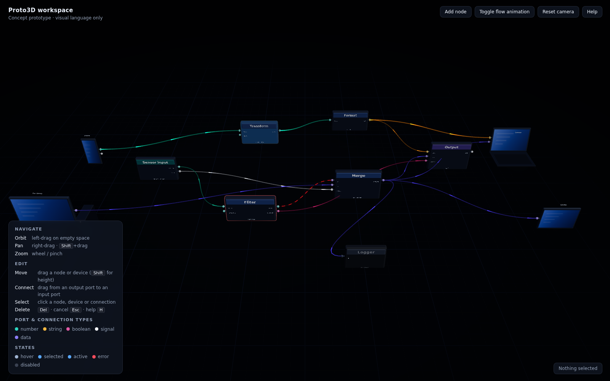
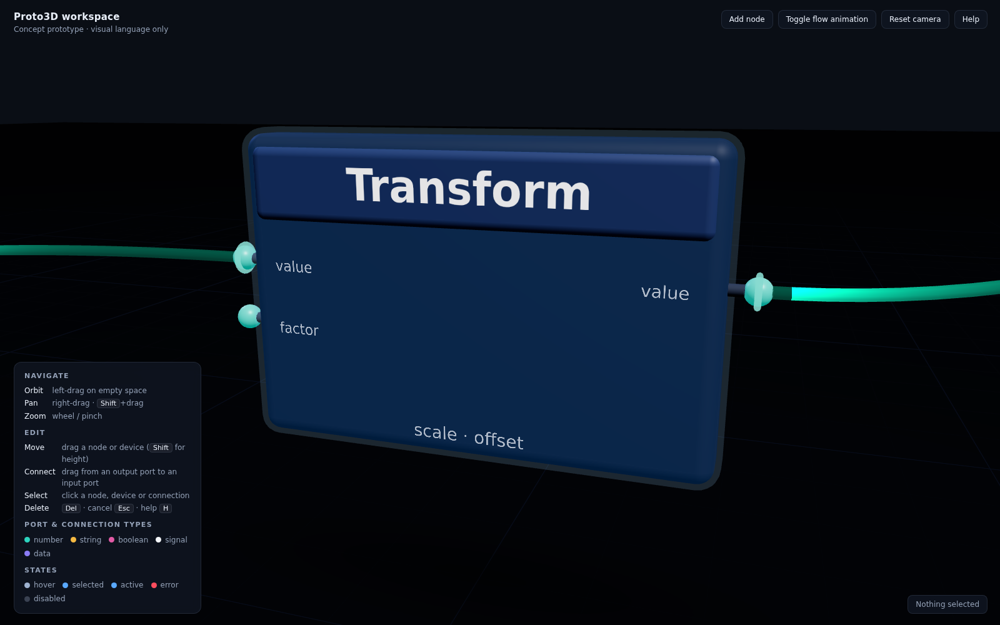

# Proto3D — a 3D visual-programming workspace (concept prototype)

Proto3D is a browser-based concept prototype for a fully 3D node-graph workspace: the
usability of Blueprint / Blender-style node editing, placed in a calm, premium 3D room.
This first step establishes the **visual language only** — how the workspace feels, how
nodes, devices and connections look, how they are positioned, moved and wired, and how all
of it lives together in one modular design system. Nothing computes yet; everything is
built so that it can.





More: [`docs/shots/devices.png`](docs/shots/devices.png) shows nodes wired into a laptop and a tablet.

## Run

Static files, no build step.

- **Any static server**: `python3 -m http.server` in this folder, then open `http://localhost:8000/`.
- **GitHub Pages**: publish the folder as-is (all paths are relative).
- **file://**: double-click `index.html` in a browser that allows module scripts from disk (Chrome does; Three.js is loaded from unpkg via an import map, so an internet connection is required).

Three.js r160 is pulled from `https://unpkg.com/three@0.160.0/` through the import map in
`index.html`. To run offline, copy `node_modules/three` next to the page and point the two
import-map entries at it.

## Module map

| File | Owns |
| --- | --- |
| `index.html` | Import map, viewport, HTML overlay (title, toolbar, help/legend panel, selection readout). |
| `styles.css` | Overlay styling only; the 3D look lives in `theme.js`. |
| `src/main.js` | Boots the workspace, builds the demo, wires interaction, toolbar and the render loop. Exposes `window.__proto` for debugging. |
| `src/theme.js` | **Single source of truth**: palette, port-type colors, state colors, sizes, spacing, typography, materials factory, 3D text labels, contact-shadow texture. |
| `src/workspace.js` | The room: renderer, camera + OrbitControls, lights, gradient floor, two-level grid, fog, `resetCamera()`. |
| `src/node3d.js` | `Node3D` (rounded slab, header band, title, ports, footer, rim glow, states) and `createPort()` — the port anatomy shared by devices. |
| `src/device3d.js` | `Device3D`: phone, tablet, laptop, desktop stand-ins with glowing screens and node-style ports. |
| `src/connection3d.js` | `Connection3D`: Bezier tube between ports with animated packet flow, end rings, states; global flow toggle. |
| `src/interaction.js` | Raycast hover / select / drag / drag-to-connect / keyboard; disables orbit while dragging. |
| `src/scene-demo.js` | The demo graph and the tiny `world` model (add / remove blocks and connections, free-slot finder). |

Each component is an ES module with no dependency on the others except `theme.js`
(and `device3d.js` → `createPort` from `node3d.js`). Swap or extend any one independently.

## Design language

### Workspace
- **Palette**: near-black blue-grey background `#0a0e15`, slate slabs `#1c2536`, dim text `#93a0b6`, primary text `#e8eef8`. Color is reserved for meaning: port types and states. Everything else is neutral.
- **Floor**: a radial gradient disc (lighter under the work, fading to the fog color) with a 1-unit minor grid and a 5-unit major grid at low opacity. Exponential fog blends distance into the background, so the room has no visible edge.
- **Light**: hemisphere sky/ground + a warm key from above-front + a cool fill from behind. Soft, directional, no hard shadows; nodes carry a fake contact shadow on the floor so height is legible.
- **Scale**: `1 unit = 10 cm`. Default node: 4 × 2.4 × 0.5 units (40 × 24 × 5 cm). Devices are roughly real-size (phone 16 × 32 cm, laptop 42 cm wide).
- **Spacing rule**: at least 1.5 node-widths of clear space between node origins; the demo uses a loose grid with a pitch of 10 units in X (flow direction) and 6 units in Z. Height (Y) is free and is used to separate parallel branches.
- **Flow direction**: left to right. Inputs face −X, outputs face +X, always.

### Node anatomy
```
   ┌──────────────────────────┐   header band (category tint, proud of the body)
   │        Title             │   title label (canvas texture on a plane, lives in 3D)
 ●─┤ value             value  ├─●  ports: in on the left face, out on the right face
 ●─┤ factor                   │      stem + colored sphere; name printed on the front face
   │                          │   body: rounded slab (RoundedBoxGeometry)
   │       scale · offset     │   footer line (dim, small): type hint / id / status
   └──────────────────────────┘   rim: back-face shell that lights up for hover / selected / error
   ░░░░░░░ contact shadow ░░░░░░
```
Node height grows with the larger of its input / output counts. Header tints: source (teal), process (blue), sink (violet) — hue only, kept low-saturation so ports stay the loudest color on the node.

### Node states
| State | Look |
| --- | --- |
| idle | slate body, category header, no rim |
| hover | soft grey-blue rim (`#9fb3d1`), transient, overlays any state |
| selected | blue rim (`#5aa9ff`) at higher opacity |
| active | slow emissive breath on the body + pulsing blue rim |
| error | red rim (`#ff4d5e`), strongest opacity; wins over selected/hover |
| disabled | desaturated body and header, grey ports, faded labels |

`node.setState('idle' | 'selected' | 'active' | 'error' | 'disabled')`; hover is separate (`setHover(bool)`).

### Port types
| Type | Color | Meaning |
| --- | --- | --- |
| number | teal `#2dd4bf` | scalar values |
| string | amber `#f5b942` | text |
| boolean | magenta `#e25aa6` | true / false, gates |
| signal | white `#f4f6fa` | events, triggers (no payload) |
| data | violet `#8b7cf6` | objects, records, streams |

The same table colors the ports, the connection tubes, their end rings and the legend. Hovering a port scales it up and brightens it; that is the affordance for "drag from here".

### Connection semantics
- **Shape**: cubic Bezier from an output to an input with horizontal tangents (handle length = 45 % of the endpoint distance, min 1.5 units), rendered as a tube. Curves stay smooth in all three axes, so height differences read naturally.
- **Direction**: bright "packets" travel from output to input; the packet head is sharp, the tail fades. Packet count scales with length (one per ~4 units) so density looks the same everywhere.
- **Speed**: idle flow is slow (0.6); active is ~2.5× faster and brighter. Speed = "how alive is this link". The toolbar toggle freezes flow globally.
- **Thickness**: idle 0.035, active 0.05, selected 0.06 units. Thickness = attention, not bandwidth.
- **End rings**: a small torus at each endpoint, oriented along the tangent, in the connection color.

| State | Look |
| --- | --- |
| idle | thin, dim, slow packets |
| active | thicker, brighter, fast packets |
| selected | thickest, blue back-face outline (hover shows a grey outline) |
| invalid | red, dashed, no packets — shown for a type mismatch (e.g. number → data) |

Connections re-fit themselves every frame when either endpoint moves.

### Devices
Phone, tablet, laptop and desktop are low-detail stand-ins: rounded dark frames and a glowing gradient screen with abstract UI lines. Rules:
- Devices are **blocks like nodes**: same port anatomy, same states, same rim, same contact shadow, same drag/connect behaviour.
- Devices sit on the floor at real-ish scale; nodes float. The difference in posture is what tells them apart, not color.
- A device's screen is its "active" indicator (brighter, pulsing when active; dim when disabled).
- Ports attach to the screen slab, centered vertically, in on the left and out on the right — a phone that sends sensor data has outputs, a laptop that displays has inputs.

### Interaction
| Action | Input |
| --- | --- |
| Orbit / pan / zoom | left-drag on empty space / right-drag / wheel (OrbitControls, damped, cannot go below the floor) |
| Move a block | drag its body along its horizontal plane; hold `Shift` to move vertically |
| Connect | drag from an output port; a live preview tube follows the pointer, snaps to a hovered input, turns red-dashed on a type mismatch; release to create |
| Select | click a node, device or connection; click empty space to clear |
| Delete | `Delete` / `Backspace` removes the selection (removing a block removes its connections) |
| Cancel | `Esc` cancels a drag or connect and clears the selection |
| Help | `H` or the Help button toggles the legend panel |

Orbit controls are disabled while dragging or connecting, so the camera never fights the hand.

## Next steps / roadmap
1. **Data model**: a graph document (nodes, ports, connections, devices, positions) independent of the 3D objects; the scene becomes a view of it.
2. **Make components functional**: node types with real evaluate functions, typed ports with coercion rules, live values shown on ports and inside packets.
3. **Serialization**: JSON save/load, undo/redo, layout persistence, share links.
4. **Device integration**: real device discovery and status (online / offline / streaming) driving the device states.
5. **Editing ergonomics**: node palette / search, snapping to the grid and to heights, auto-layout, grouping / frames, comments.
6. **Generation**: emit code or configuration from the graph; import existing pipelines into the 3D room.
7. **Design system hardening**: light theme, accessibility contrast checks, instanced ports for large graphs, LOD for labels.
