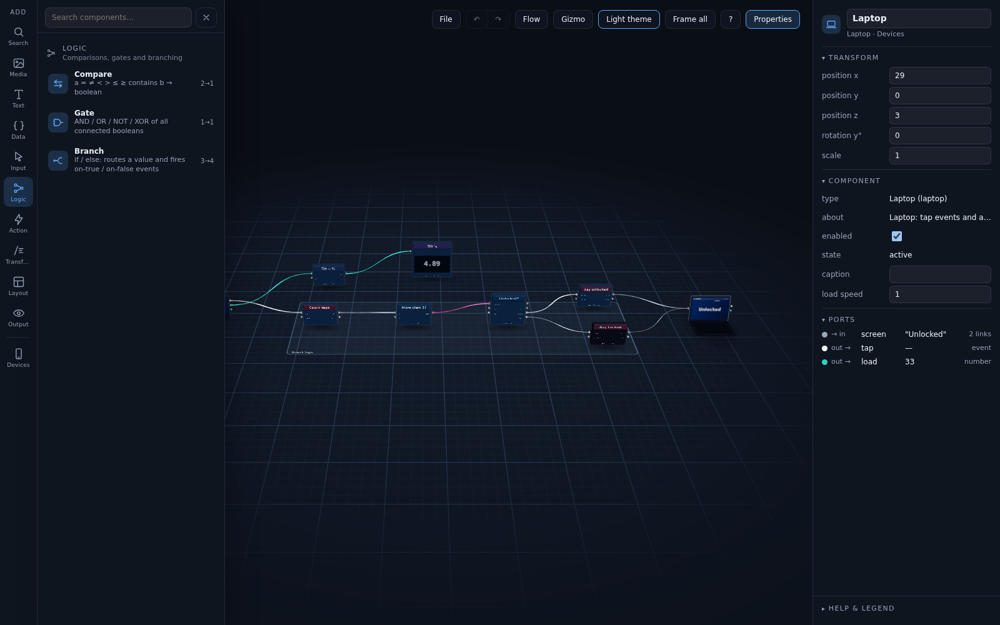
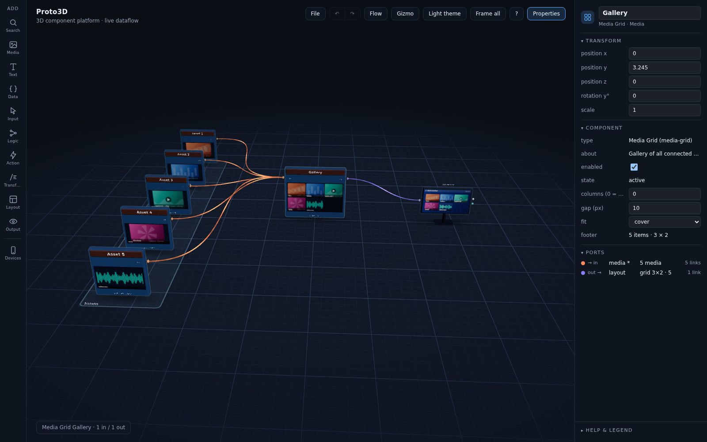

# Proto3D — a 3D component platform for building real systems

Proto3D is a browser-based workspace where **components** (media, text, data, inputs, logic,
actions, transforms, layouts, outputs and devices) live as blocks in a calm 3D room, connected
by typed, animated links, and **actually run**: a dataflow engine evaluates the graph every
frame, events propagate from a tapped phone screen to a laptop display, a Media Grid arranges
whatever media you plug into it, and a Layout node physically arranges its neighbours in space.

This round rebuilt the prototype as a **platform**: one component schema, a registry that drives
the toolbar / panel / engine / serialization, six port types with strict compatibility, an
event bus, groups that collapse into a single slab, level-of-detail for large systems, undo /
redo, save / load and a left **Add** toolbar with search and drag-and-drop.





More shots: [`overview-lod.png`](docs/shots/overview-lod.png) (zoomed out: far LOD, a collapsed
group), [`connection-hover.png`](docs/shots/connection-hover.png) (hovered link isolated with its
type / value label), [`light-theme.png`](docs/shots/light-theme.png).

## Run

Static files, no build step.

- **Any static server**: `python3 -m http.server` in this folder, then open `http://localhost:8000/`.
- **GitHub Pages**: publish the folder as-is (all paths are relative).
- **file://**: open `index.html` in a browser that allows module scripts from disk (Chrome does).

Three.js r160 comes from `https://unpkg.com/three@0.160.0/` through the import map in
`index.html`; to run offline, copy `node_modules/three` next to the page and point the two
import-map entries at it. The first load shows the *Phone → Logic → Laptop* example; after that
the workspace restores your autosaved world from `localStorage` (**File → New** clears it).

## Try it in one minute

1. **Tap the phone** (click its screen) four times: `Count taps` → `More than 3?` → `Unlocked?` →
   `Say Unlocked` → the laptop screen reads **Unlocked**. Change `b` on the Compare node in the
   properties panel and watch the logic re-decide.
2. **File → Examples → Media → Media Grid → Monitor**. Click a Media node and switch its `mode`
   or `source`; the gallery and the monitor follow.
3. Open the left **Add** toolbar, drag a **Layout** into the scene, connect a few nodes into its
   `items` input and switch its `mode` between row / column / grid / circle: the nodes move.
4. Select two nodes, `Ctrl+G`, then `C`: the group folds into one slab whose ports are the
   connections that cross its boundary. `F` frames the selection, `Home` frames everything.

## Architecture

```
src/
  core/         component schema, registry, port types, engine, world model, commands, history
  components/   one file per component type, grouped by category; index.js registers them all
  block3d.js    Block3D: what nodes and devices share (ports, rim, shadow, face, LOD, serialize)
  node3d.js     Node3D: rounded slab with header, port rows, optional face, footer
  device3d.js   Device3D: phone / tablet / laptop / monitor whose screen is the component face
  faces.js      2D drawing helpers for faces and screens (text, JSON, media, grids)
  connection3d.js + routing.js   typed tubes with flow sheen; lanes, lift, obstacle avoidance
  groups.js     Group3D: frame on the floor, collapse to a slab with proxy ports
  selection.js, lod.js, serialize.js, interaction.js, gizmo.js, panel.js, workspace.js, theme.js
  ui/           toolbar-left.js (Add toolbar), file-menu.js
  examples/     the two demos + the tiny builder API
```

The full design is in [`docs/ARCHITECTURE.md`](docs/ARCHITECTURE.md). The short version:

| Layer | Module | Responsibility |
| --- | --- | --- |
| **Schema** | `core/component.js` | `defineComponent(def)` validates one definition object: `id, category, label, description, icon, inputs[], outputs[], params[], size, evaluate(ctx), onEvent?, face?, onCreate?, onDestroy?`. |
| **Registry** | `core/registry.js` | Every type registers here. The registry drives the Add toolbar (categories, icons, search), the properties panel (params → controls), the engine (`evaluate`), node construction (ports) and serialization (type id + params + state). |
| **Types** | `core/types.js` | Six port types `number, text, boolean, data, media, event` plus `any`. `compatible(from, to)` → `ok / coerce / invalid` (only `number → text` coerces); `formatValue`, `equal`, pulses. |
| **Engine** | `core/engine.js` | Evaluates every frame in topological order (cycles: back-edges use previous-frame values), pulls values along connections (multi inputs → arrays; several links into one input → most recently changed wins), coerces, runs the event bus so pulses propagate within the pass, caches values on connections and tracks `changedAt` per output. |
| **World** | `core/world.js` | `nodes`, `connections`, `groups` and the low-level mutations; `layoutVersion` bumps when anything moves so connections re-route. |
| **Commands / History** | `core/commands.js`, `core/history.js` | Every edit (add, remove, move, param, connect, group, collapse, duplicate, rename, enable) is a command; `History` gives undo / redo and coalesces rapid param edits. |
| **Serialization** | `serialize.js` | World ↔ JSON (`version 2`): components (type, params, serializable state, transform), connections (node uid + port key), groups, camera. Debounced autosave to `localStorage`. |
| **UI** | `ui/toolbar-left.js`, `panel.js`, `ui/file-menu.js`, `interaction.js` | Add toolbar, properties panel, File menu, and the pointer / keyboard model (selection, marquee, drag, connect, face clicks). |

### Component schema, worked example

Create `src/components/transform/smooth.js` and import it from `src/components/index.js`.
Nothing else changes: it appears in the toolbar under Transform, gets its params in the panel,
evaluates, serializes and can be searched.

```js
// Smooth — exponential moving average of a number.
import { registry } from '../../core/registry.js';
import { icons } from '../../icons.js';
import { clear, drawText } from '../../faces.js';

export default registry.register({
  id: 'smooth', category: 'transform', label: 'Smooth', icon: icons.transform, size: 'M',
  description: 'Exponential moving average of a number',
  inputs:  [{ key: 'in', label: 'in', type: 'number' }, { key: 'reset', label: 'reset', type: 'event', optional: true }],
  outputs: [{ key: 'out', label: 'out', type: 'number' }],
  params:  [{ key: 'alpha', label: 'smoothing', type: 'number', default: 0.1, min: 0.01, max: 1, step: 0.01 }],
  // ctx = { inputs, params, state, time, dt, emit(key, payload), touch(key), instance, upstream(key), engine }
  evaluate({ inputs, params, state }) {
    if (inputs.reset) state.value = undefined;            // an event input is a pulse this frame, else undefined
    if (typeof inputs.in !== 'number') return {};         // no output → downstream sees undefined
    state.value = state.value === undefined ? inputs.in : state.value + (inputs.in - state.value) * params.alpha;
    return { out: +state.value.toFixed(4) };
  },
  footer: ({ outputs }) => (outputs.out === undefined ? 'waiting' : `≈ ${outputs.out}`),
  face: {                                                 // optional live 2D face on the node body
    render(g, w, h, { outputs }) { clear(g, w, h); drawText(g, outputs.out === undefined ? '—' : String(outputs.out), 0, 0, w, h, { size: 64, mono: true }); },
  },
});
```

Rules of the schema: `id` is lowercase with dashes; port keys are unique per direction; port
types are one of the seven; params are `number | text | boolean | select | json | color`. Event
outputs are pulsed with `ctx.emit(key, payload)` (or by returning a value for that key); `state`
is a plain object that persists per instance and is saved when it is JSON-serializable;
`face.onPointer(ctx, { type, u, v })` receives clicks and drags on the face in 3D; `onCreate` /
`onDestroy` are for listeners (the Input component's key mode uses them).

## Core components (17)

| id | Category | Inputs | Outputs | Params (mode first) | Purpose |
| --- | --- | --- | --- | --- | --- |
| `media` | Media | — | `media` media | mode image/video/audio · source sample 1–6 / custom URL · url · title | One asset; samples are generated offline (images, animated poster for video, WAV for audio). Face shows it. |
| `media-grid` | Media | `items` media\* | `layout` data | columns (0 = auto) · gap · fit | Gallery of every connected media; face renders it; layout `{items, cols, rows}` feeds screens. |
| `text` | Text | `in` any\* | `text` text | mode source/uppercase/lowercase/template/join · text · template (`{value} {name} {0}`) · separator | Strings and string operations. Face shows the result. |
| `data` | Data | `in` data\* | `data` data · `value` any | mode value/pick/filter/count/merge · JSON · path · key · op · value | JSON source, path pick, filter a list, count, merge. |
| `input` | Input | — | `trigger` event · `value` any | mode button/toggle/key/timer/slider · label · key · interval · value/min/max | Interactive face: tap, flip, press a key, tick, drag a slider. |
| `compare` | Logic | `a` any · `b` any | `result` boolean | op = ≠ < > ≤ ≥ contains · b fallback | a ⋈ b. |
| `gate` | Logic | `in` boolean\* | `result` boolean | mode AND/OR/NOT/XOR | Combine booleans. |
| `branch` | Logic | `condition` boolean · `value` any · `trigger` event | `then` any · `else` any · `on true` event · `on false` event | — | if / else: routes a value and fires when the condition flips (or on trigger). |
| `action` | Action | `trigger` event · `payload` any | `result` any · `done` event | mode pass/toggle/count/latch/delay · payload fallback · delay ms | Do something on an event. |
| `transform` | Transform | `a` number · `b` number | `result` number | mode math/map range/clamp/round/invert · op + − × ÷ mod pow min max · ranges | Number processing. |
| `layout` | Layout | `items` any\* | `list` data | mode row/column/grid/circle · spacing · columns · distance · arrange | Physically arranges the connected components around itself. |
| `display` | Output | `in` any | — | caption | Face renders any value: text, number, boolean, JSON, media, gallery. |
| `log` | Output | `in` any · `trigger` event | `count` number | keep (≤ 8) | Last entries with timestamps on its face. |
| `phone` | Devices | `screen` any | `tap` event · `tilt` number · `battery` number | caption · tilt speed | Handheld; clicking the screen emits `tap`. |
| `tablet` | Devices | `screen` any | `tap` event · `tilt` number | caption · tilt speed | Tablet. |
| `laptop` | Devices | `screen` any | `tap` event · `load` number | caption · load speed | Laptop; the screen renders whatever arrives. |
| `monitor` | Devices | `screen` any | `tap` event · `ambient` number | caption · ambient speed | Large screen. |

`*` = multi input (accepts many links; the component receives an array in connection order).
Devices are components with the same anatomy as nodes; they stand on the floor at rough real
scale. Video playback is not attempted: a video asset is an animated poster frame with a play
glyph and a progress bar (honest fallback for headless and offline use).

## Workspace controls

| Action | Input |
| --- | --- |
| Orbit / pan / zoom | left-drag on empty space / right-drag / wheel |
| Focus | `F` frames the selection · double-click a block · `Home` or **Frame all** frames everything (camera flights are smooth) |
| Add | left toolbar → category → click a component (adds at the camera target on a free slot) or **drag it into the scene** (ghost footprint, drops where the ray hits the floor) · `Shift+A` opens search |
| Move | drag a block (all selected blocks move together; `Shift` for height) · gizmo `G`, `W` / `E` / `R` · Transform fields in the panel |
| Connect | drag from an output port to an input port; the preview turns red-dashed on a type mismatch |
| Select | click · `Shift`+click adds / toggles · `Shift`+drag on the floor draws a marquee · `Ctrl+A` all · click empty space clears |
| Edit | `Ctrl+D` duplicate (with internal connections) · `Delete` · `Ctrl+Z` / `Ctrl+Shift+Z` (or `Ctrl+Y`) undo / redo · the top bar has ↶ ↷ |
| Group | `Ctrl+G` group the selection · `C` collapse / expand · `Ctrl+Shift+G` ungroup · drag the frame to move the whole group · rename in the panel |
| Interact | click a device screen (`tap`), an Input face (button, toggle, slider) or press the configured key |
| File | **File** → New · Save JSON · Load JSON · Examples; autosave to `localStorage` on every change |
| View | `T` theme · `N` properties panel · `H` help & legend · `Esc` cancel |

Shortcuts are ignored while typing in a panel field.

## Connection semantics

- **Type** = the output port's type; a link is **valid** when `compatible(from, to)` is not
  `invalid`: same type, either side `any`, or `number → text` (coerced, drawn in the
  destination colour). Invalid links are red and dashed, carry nothing and flag both ends as
  `error` — they are created on purpose so the mismatch is visible and fixable.
- **Direction** is left → right (inputs face −X, outputs +X) and shown by the continuous flow
  sheen; the hover label reads `type · from → to · value`.
- **Active** = the source changed or pulsed within 1.5 s (thicker, brighter, faster sheen);
  **idle** = carries a stable value; **inactive** = carries nothing (thin, dim).
- **Routing** (`routing.js`): cubic Bezier with horizontal tangents; connections sharing a
  source or destination fan out into lanes (small vertical / depth offsets); long links lift
  slightly; any link whose samples pass through another block's bounding box raises its control
  points until it clears the box. Backward links widen their handles into a readable loop.
- **Hover** isolates the path: every other connection dims to 25 %; **click** selects and the
  panel shows from / to / type / state / value / changes per second.
- **Multi inputs** receive an array (connection order). A single input with several links takes
  the **most recently changed** upstream value (this is how two Actions can share one screen).
- **Events** are pulses `{ t, n, payload }` that exist for one pass; a collapsed group exposes
  every boundary-crossing link on a proxy port so the interface stays visible.

## Design language

The good parts of round two are kept: two palettes in `theme.js` (dark near-black blue-grey /
light off-white; port-type hues are identical across themes, darkened for contrast in light),
colour reserved for meaning (types and states), the gradient floor with a 1 / 5-unit grid and
exponential fog (which now thins as the camera pulls back), hemisphere + key + fill light with
fake contact shadows, `1 unit = 10 cm`, a 10 × 6.5 unit layout pitch, flow left to right.

**Node anatomy**: header band tinted by category (ten low-saturation hues) with the title,
port rows just under the header (in left, out right, multi ports slightly larger), an optional
live canvas **face** below the rows (size M or L), a dim footer with the output value, a rim for
hover / selected / error, and a contact shadow. Devices share ports, rim, shadow and states;
their screen is the face. **Groups** are translucent rounded frames on the floor with a title
at the front edge; collapsed, they become a slab with a header band and proxy ports.

**States** are derived by the engine, never hard-coded: `disabled` (unchecked *enabled*) >
`error` (invalid link attached or `evaluate` threw) > `active` (an output changed / pulsed within
1.5 s) > `idle`; selection and hover overlay them as rims.

**Level of detail**: beyond the LOD distance (110 units, editable in the workspace panel) port
labels and footers fade out, titles lift above the slab and grow with distance like map labels,
connections thin, group titles enlarge; below it everything crossfades back.

**Port & connection colours** (dark / light): number teal `#2dd4bf` / `#0f9f8f`, text amber
`#f5b942` / `#c07f0c`, boolean magenta `#e25aa6` / `#c2388a`, data violet `#8b7cf6` / `#6a5cd6`,
media coral `#ff8a5b` / `#d9633a`, event white `#f4f6fa` / slate `#48556b`, any grey `#9aa7bb` /
`#6b7788`. The same table colours ports, tubes, rings, panel dots and the legend.

## Roadmap

1. **More primitives, same schema**: HTTP / WebSocket sources, a Script component with a sandboxed
   `evaluate`, a Table view, a Chart output, a Store (persisted key-value) component.
2. **Real devices**: pair a phone through WebRTC so `tap` / `tilt` / `battery` are real; device
   presence drives the states.
3. **Routing at scale**: bundle parallel links, avoid group frames, and an auto-layout command
   (the Layout node already does it for its neighbours).
4. **Editing**: copy / paste across worlds, snapping, comments on the floor, sub-graphs
   (a group as a reusable component).
5. **Media**: real `<video>` / `<audio>` playback where the browser allows it, drag-and-drop of
   files onto a Media node, thumbnails in the panel.
6. **Hardening**: instanced ports for thousands of nodes, occlusion-aware LOD, keyboard-only
   navigation, contrast checks for both themes.
